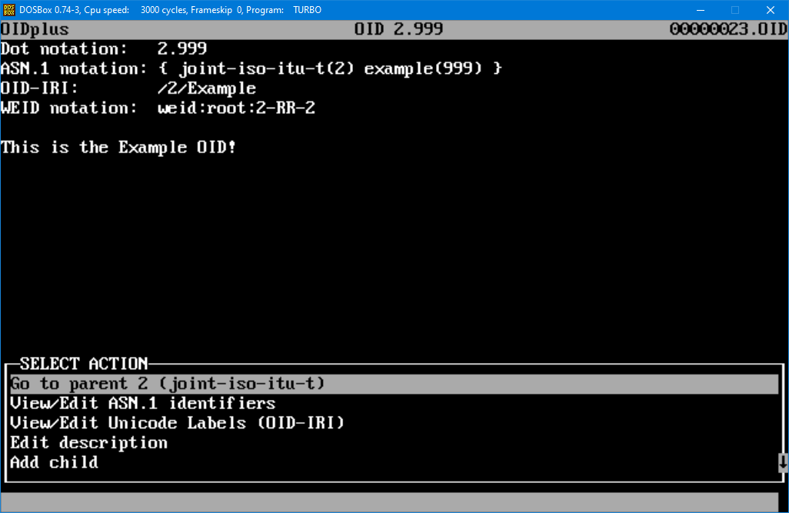
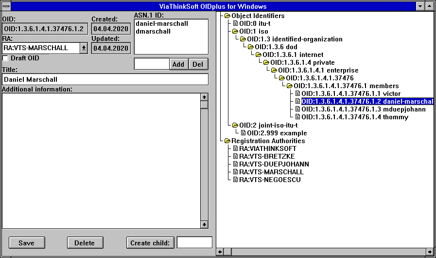
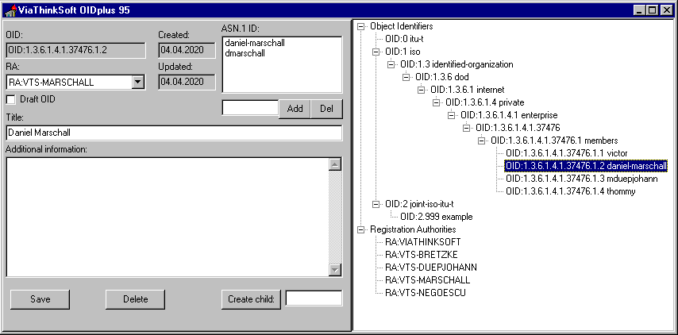
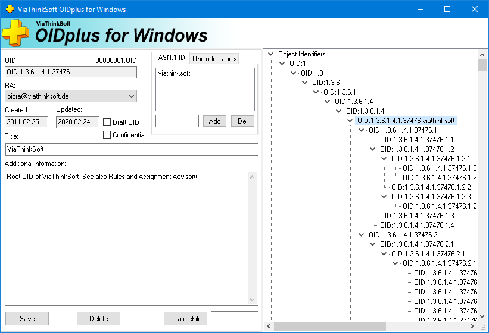

# OIDplus for Windows and DOS (Nostalgia)

This is a retro-coding product of OIDplus, aiming for MS DOS, Windows 3.11, and Windows 95+.
It is just a small gimmick / fun-project and should not be used for productive use!
Please use [the official version of OIDplus](https://github.com/danielmarschall/oidplus)

## OIDplus for MS-DOS

## OIDplus for Windows 3.11

## OIDplus for Windows 95

## OIDplus for Windows 64 Bit

